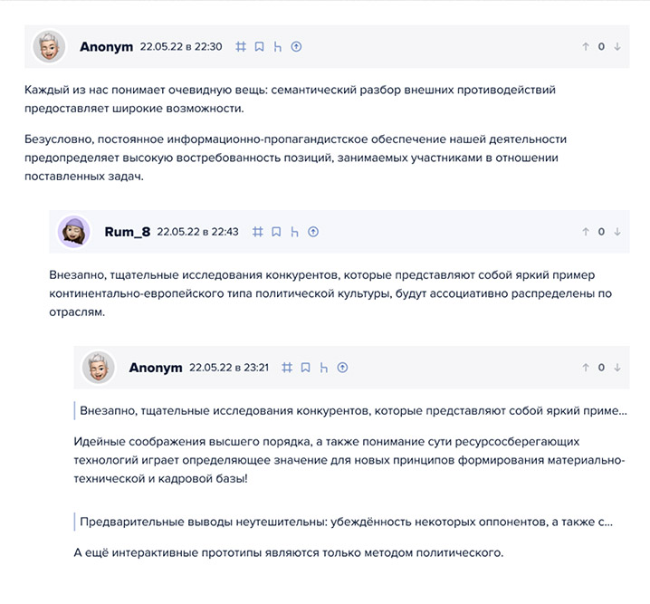

SPA-приложение: Комментарии.
===
- Пользователь может оставлять комментарии, как на картинке;
- Все введенные комментарии пользователем сохраняются в реляционной базе 
данных (БД), включая данные о пользователе (данные которые помогут 
идентифицировать клиента).



#### Обязательно использовать:

- Object-oriented programming (OOP)
- SQL (на ваш выбор)
  - MySQL
  - PostgreSQL 
  - SQLite

#### Форма добавления записи должна иметь поля:

1. **User Name** (цифры и буквы латинского алфавита) – обязательное поле.
2. **E-mail** (формат email) – обязательное поле.
3. **Home page** (формат url) – необязательное поле.
4. **CAPTCHA** (цифры и буквы латинского алфавита) – изображение и 
обязательное поле ([пример](http://ru.wikipedia.org/wiki/CAPTCHA)).
5. **Text** (непосредственно сам текст сообщения, все HTML теги не допустимы,
кроме разрешенных) – обязательное поле.

#### Требования к форме добавления записи:

1. На каждую запись можно написать сколько угодно записей (каскадное 
отображение).
2. Заглавные Комментарии (те, которые не являются ответом) должны выводится в 
виде таблицы, с возможностью сортировки по следующим полям: User Name, E-mail,
 и дата добавления (как в порядке убывания, так и в обратном)
3. Сообщения должны разбиваться на страницы по 25 сообщений на каждой.
4. При написании проекта следует обратить внимание на защиту от 
[XSS](http://ru.wikipedia.org/wiki/Межсайтовый_скриптинг) атак и
[SQL – инъекций](http://ru.wikipedia.org/wiki/Инъекция_SQL)
5. Сортировка по умолчанию – LIFO.
6. Приветствуется создание простейшего дизайна с использованием CSS.
   
#### JavaScript и работа с файлами

1. К сообщению пользователь может добавить картинку или текстовый файл.
2. Изображение должно быть не более 320х240 пикселей, при попытке залить
изображение большего размера, картинка должна быть пропорционально
уменьшена до заданных размеров, допустимые форматы файлов: JPG, GIF, PNG.
3. Текстовый файл не должен быть больше чем 100 кб, формат TXT.
4. Просмотр файлов должен сопровождаться визуальными эффектами 
([пример](https://lokeshdhakar.com/projects/lightbox2/))

#### Регулярные выражения

1. Пользователь может использовать следующие разрешенные HTML теги в 
сообщениях:

 > ```<a href=”” title=””> </a>```<br>
 > ```<code> </code>```<br>
 > ```<i> </i>```<br>
 > ```<strong> </strong>```
2. Должна быть проверка на закрытие тегов, код должен быть валидным XHTML.


#### JavaScript и AJAX

1. Валидация вводимых данных на стороне сервера и клиента.
2. Функция пред просмотр сообщения, без перезагрузки страницы.
3. Для HTML тегов сделать панель с кнопками ([i], [strong], [code], [a]).
4. Добавление визуальных эффектов так же приветствуется.
 
### Требования к результату (для всех уровней)

#### Обязательные инструменты для разработчика:

- NestJS / ExpressJS
- ORM
- Frontend (на ваш выбор):
  - Vue
  - React
  - Angular
- Git
- WebSocket (WS)

#### Ожидаемый формат вашего тестового в результате

- **Развёрнуть** (Хостинг / VDS), результат будет проверятся тестировщиком по 
чек-листу, прежде чем будут смотреть тех.специалисты подразделения.
- **Git-репозиторий**, для анализа ветвлений в процессе выполнения тестового.
- **Read.me**, так чтобы по нему было понятно что это за проект и какие функции
в нём есть.
- **Файл схемы БД**, который можно открыть в программе MySQL Workbench, чтобы
сравнить что вы спроектировали, а что в итоге реализовали в тестовом.

#### Cамопроверка

Для самопроверки, перед тем как говорить что всё готово, попробуйте запустить 
свой проект с нуля по вашему **Read.me** из вашего **Git-репозитория**.

## Для уровня **Junior+**

Улучшите решение, путем добавления инструментов предыдущего и текущего уровней:
- Docker
- Queue
- Cache
- Events
- JWT

## Для уровня **Middle**

Улучшите решение, путем добавления инструментов
предыдущего и текущего уровней:
- Graph (на ваш выбор):
  - GraphDb
  - GraphQL
- Брокер сообщений (на ваш выбор): 
  - RabbitMQ
  - Kafka
- NoSQL:
  - Elasticsearch (мы предпочитаем)
  - Redis
  - Mongo
- Cloud (на ваш выбор):
  - Azure
  - Amazon Web Services
  - Google Cloud Platform
  - Yandex Cloud
  - другая облачная платформа

## Для уровня **Middle+**

Улучшите решение, путем архитектурных изменений:
У нас 1 000 000 сообщений, 100к пользователей в 24 часа.
- заложи в архитектуру решение,
- напиши нагрузочный тест.
